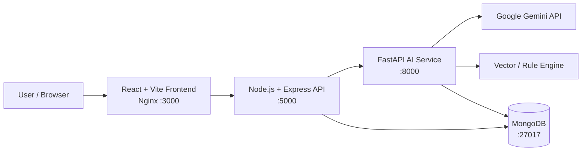

# DeepSkill AI

> **AI-powered placement readiness and resume optimization platform for students and early-career developers.**

DeepSkill AI analyzes a resume against one or more target job roles and produces compatibility scores, matching/missing skills, ATS keyword insights, actionable improvement suggestions, and tailored bullet-point transformations.

The project runs as a **Dockerized microservice stack** with a React frontend, Node.js API gateway, Python/FastAPI AI service, and MongoDB. When configured for online AI, the Python service uses the official Google Gemini SDK. A vector/rule-based analysis path is also available as a fallback.

---

## ✨ Highlights

- 📄 Resume upload and paste support
- 🎯 Analyze against **1–5 target roles**
- 🧠 Online AI analysis with **Google Gemini**
- 🔎 ATS keyword and skill-gap analysis
- 📊 Compatibility scoring and role-by-role results
- ✍️ Before/after resume bullet transformations
- 💡 Project and learning recommendations
- 🐳 Full Docker Compose deployment
- 🗄️ MongoDB-backed role configuration
- 🔁 Gemini model retry/fallback handling
- 📱 Responsive React + Tailwind UI

---

## 🏗️ Architecture



### Services

| Service | Technology | Port | Responsibility |
|---|---|---:|---|
| Frontend | React 18, Vite, Tailwind, Nginx | 3000 | User interface |
| Backend | Node.js, Express, Mongoose | 5000 | API gateway, parsing, roles |
| AI Service | Python, FastAPI, Google GenAI SDK | 8000 | Resume analysis |
| Database | MongoDB 6 | 27017 | Roles and application data |

---

## 🚀 Run with Docker

### 1. Prerequisites

Install:

- Docker Desktop
- Git
- A Google Gemini API key if using online AI

### 2. Configure environment

Copy the template:

```bash
cp .env.example .env
```

Then edit `.env`:

```env
DEPLOYMENT_MODE=docker
AI_MODE=online
AI_PROVIDER=gemini
GEMINI_API_KEY=your_real_key_here
GEMINI_MODELS=gemini-3.8-flash,gemini-3.6-flash,gemini-3.5-flash
```

**Never commit `.env` or a real API key.**

### 3. Start the stack

```bash
docker compose up --build
```

### 4. Open the application

- Frontend: http://localhost:3000
- Backend health: http://localhost:5000/api/health
- AI service health: http://localhost:8000/

To stop:

```bash
docker compose down
```

To remove the local MongoDB volume too:

```bash
docker compose down -v
```

---

## 🤖 AI Modes

DeepSkill AI supports multiple analysis paths.

### Online Gemini

When:

```env
AI_MODE=online
AI_PROVIDER=gemini
GEMINI_API_KEY=...
```

the Python service sends the resume-analysis request to Google's Gemini API.

The service can try configured Gemini models in sequence and retry transient failures.

### Vector / rule-based fallback

The repository also contains:

- ChromaDB vector similarity matching
- Sentence Transformers embeddings
- deterministic skill/section parsing
- rule-based suggestions

This provides resilience when online AI is unavailable.

> **Important:** The repository is configured for online Gemini by default in the Docker example, but the fallback implementation remains part of the project.

---

## 📁 Repository Structure

```text
DeepSkill_AI/
├── .github/
│   └── workflows/
│       └── ci.yml
├── ai_service/
│   ├── Dockerfile
│   ├── .dockerignore
│   ├── .env.example
│   ├── config.py
│   ├── gemini_analyzer.py
│   ├── main.py
│   ├── offline_engine.py
│   ├── requirements.txt
│   ├── roles_db.json
│   ├── routes.py
│   └── vector_engine.py
├── backend/
│   ├── Dockerfile
│   ├── .dockerignore
│   ├── models/
│   ├── utils/
│   ├── config.js
│   ├── package.json
│   └── server.js
├── frontend/
│   ├── Dockerfile
│   ├── .dockerignore
│   ├── nginx.conf
│   ├── src/
│   ├── package.json
│   └── vite.config.js
├── docker-compose.yml
├── .env.example
├── .gitignore
├── QUICKSTART.md
├── SETUP_GUIDE.md
├── DEPLOYMENT.md
├── PROJECT_SUMMARY.md
├── SAMPLE_RESUME.txt
└── README.md
```

---

## 🔌 API Overview

### Backend

```text
GET  /api/health
GET  /api/roles
GET  /api/categories
POST /api/parse-resume
POST /api/analyze
POST /api/suggestions
```

### AI Service

```text
GET  /
POST /api/v1/analyze
```

---

## 🔐 Security

API keys are intentionally excluded from version control.

Before pushing this project:

```bash
git status
git diff
git ls-files | grep -E '(^|/)\.env'
```

You should **not** see a real `.env` file or secret key in the staged files.

If a real Gemini key has ever been committed to a public repository, **rotate/revoke that key immediately** and create a new one.

---

## 🧪 Verification

After starting Docker:

```bash
docker compose ps
```

Check backend → AI service connectivity:

```bash
docker exec backend node -e "fetch('http://ai_service:8000').then(r=>console.log('AI SERVICE HTTP:',r.status)).catch(e=>console.error('AI SERVICE ERROR:',e.message))"
```

A healthy service should return:

```text
AI SERVICE HTTP: 200
```

Then inspect AI logs:

```bash
docker compose logs --tail=150 ai_service
```

For a successful online analysis, look for:

```text
HTTP/1.1 200 OK
Gemini analysis completed
POST /api/v1/analyze HTTP/1.1" 200 OK
```

---

## 🛠️ Local Development

### Backend

```bash
cd backend
npm install
npm start
```

### Frontend

```bash
cd frontend
npm install
npm run dev
```

### AI service

```bash
cd ai_service
python -m venv .venv
# activate the virtual environment
pip install -r requirements.txt
uvicorn main:app --reload --port 8000
```

For local development, make sure MongoDB is running and configure the relevant environment variables.

---

## 📌 Tech Stack

**Frontend**

- React 18
- Vite
- Tailwind CSS
- Framer Motion
- React Router
- Axios
- Lucide React

**Backend**

- Node.js
- Express
- MongoDB
- Mongoose
- Multer
- PDF/DOCX parsing

**AI / Data**

- Python
- FastAPI
- Google Gemini API
- `google-genai`
- ChromaDB
- Sentence Transformers

**Infrastructure**

- Docker
- Docker Compose
- Nginx

---

## 🎓 Project Context

DeepSkill AI is designed as a practical placement-readiness project for students. It demonstrates how a modern application can combine:

1. Resume parsing
2. Role/skill databases
3. Semantic matching
4. LLM-based analysis
5. ATS-oriented feedback
6. Microservice architecture
7. Containerized deployment

---

## 🔮 Future Improvements

- User accounts and analysis history
- Resume version comparison
- PDF report export
- Interview preparation
- Skill-roadmap visualization
- LinkedIn profile integration
- Company-specific resume optimization
- Automated test coverage expansion
- Production deployment with managed services

---

## 📄 License

No license has been declared yet. If you plan to publish this as open source, choose a license appropriate to your intended use before adding one to the repository.

---

## 👤 Author

**DeepSkill AI — Placement Readiness Platform**

If you find the project useful, consider giving the repository a ⭐.
