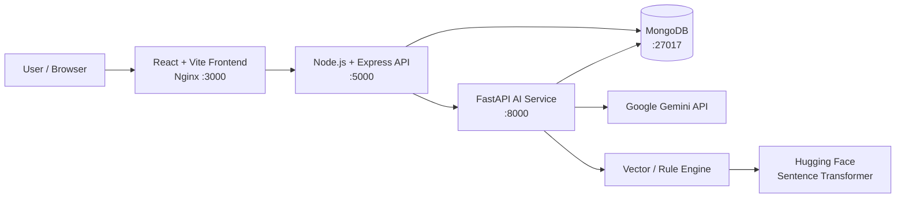

# DeepSkill AI

> **AI-powered placement readiness and resume optimization platform for students and early-career developers.**

DeepSkill AI analyzes a resume against one or more target job roles and produces compatibility scores, matching/missing skills, ATS keyword insights, actionable improvement suggestions, and tailored bullet-point transformations.

The project runs as a **Dockerized microservice stack** with a React frontend, Node.js API gateway, Python/FastAPI AI service, and MongoDB. When configured for online AI, the Python service uses the official Google Gemini SDK. A vector/rule-based analysis path is also available as a fallback.

---

## ✨ Highlights

* 📄 Resume upload and paste support
* 🎯 Analyze against **1–5 target roles**
* 🧠 Online AI analysis with **Google Gemini**
* 🔎 ATS keyword and skill-gap analysis
* 📊 Compatibility scoring and role-by-role results
* ✍️ Before/after resume bullet transformations
* 💡 Project and learning recommendations
* 🐳 Full Docker Compose deployment
* 🗄️ MongoDB-backed role configuration
* 🔁 Gemini model retry/fallback handling
* 📱 Responsive React + Tailwind UI
* 🤗 Hugging Face / Sentence Transformers support
* 🔬 Vector similarity matching with ChromaDB

---

## 🏗️ Architecture



### Services

| Service       | Technology                        |  Port | Responsibility               |
| ------------- | --------------------------------- | ----: | ---------------------------- |
| Frontend      | React 18, Vite, Tailwind, Nginx   |  3000 | User interface               |
| Backend       | Node.js, Express, Mongoose        |  5000 | API gateway, parsing, roles  |
| AI Service    | Python, FastAPI, Google GenAI SDK |  8000 | Resume analysis              |
| Database      | MongoDB 6                         | 27017 | Roles and application data   |
| Vector Engine | ChromaDB + Sentence Transformers  |     — | Semantic role/skill matching |

---

# 🚀 Run with Docker

## 1. Prerequisites

Install:

* Docker Desktop
* Git
* A Google Gemini API key if using online AI
* A Hugging Face token for authenticated model downloads

---

## 2. Configure environment

### Windows PowerShell

From the project root:

```powershell
Copy-Item .env.example .env
Copy-Item backend\.env.example backend\.env
Copy-Item ai_service\.env.example ai_service\.env
Copy-Item frontend\.env.development.example frontend\.env.development
Copy-Item frontend\.env.production.example frontend\.env.production
```

### macOS / Linux

```bash
cp .env.example .env
cp backend/.env.example backend/.env
cp ai_service/.env.example ai_service/.env
cp frontend/.env.development.example frontend/.env.development
cp frontend/.env.production.example frontend/.env.production
```

Then edit the root `.env` file and add your own credentials.

Example:

```env
DEPLOYMENT_MODE=docker
AI_MODE=online
AI_PROVIDER=gemini

GEMINI_API_KEY=your_real_gemini_key_here
GEMINI_MODELS=gemini-3.8-flash,gemini-3.6-flash,gemini-3.5-flash

HF_TOKEN=your_huggingface_token_here

USE_HYBRID_AI=true

MONGODB_URI=mongodb://mongodb:27017/deepskill
PYTHON_SERVICE_URL=http://ai_service:8000
CORS_ORIGIN=http://localhost:3000
```

**Never commit `.env` files or real API keys.**

The Hugging Face token is used for authenticated access when the Sentence Transformers embedding model is downloaded from Hugging Face.

---

## 3. Start the stack

```bash
docker compose up --build
```

The first startup may take longer because the AI service needs to install dependencies and load the Sentence Transformer model.

---

## 4. Open the application

* Frontend: http://localhost:3000
* Backend health: http://localhost:5000/api/health
* AI service health: http://localhost:8000/

---

## 5. Verify the containers

```bash
docker compose ps
```

You should see these services running:

```text
frontend
backend
ai_service
mongodb
```

---

## 6. Verify backend → AI service connectivity

```bash
docker exec backend node -e "fetch('http://ai_service:8000').then(r=>console.log('AI SERVICE HTTP:',r.status)).catch(e=>console.error('AI SERVICE ERROR:',e.message))"
```

Expected result:

```text
AI SERVICE HTTP: 200
```

---

## 7. Check AI service logs

```bash
docker compose logs --tail=150 ai_service
```

A successful startup should contain information similar to:

```text
Runtime Version : 2.2
Deployment Mode : docker
AI Mode         : online
AI Provider     : gemini
Gemini Key      : configured
```

You should also see the vector engine loading and indexing the configured roles.

For a successful online analysis, the AI service should process:

```text
POST /api/v1/analyze
```

with a successful response.

---

## 8. Stop Docker

```bash
docker compose down
```

To also remove the local MongoDB volume:

```bash
docker compose down -v
```

> **Warning:** `docker compose down -v` removes the MongoDB Docker volume and therefore removes locally stored MongoDB data.

---

# 💻 Run Without Docker

Docker is the recommended way to run the complete project, but the individual services can also be started manually.

This setup is useful for local development and debugging.

## 1. Prerequisites

Install:

* Node.js
* Python 3
* MongoDB
* Git
* Google Gemini API key
* Hugging Face token

Make sure MongoDB is running locally.

The expected local MongoDB connection is:

```text
mongodb://localhost:27017/deepskill
```

---

## 2. Configure environment files

From the project root:

### Windows PowerShell

```powershell
Copy-Item .env.example .env
Copy-Item backend\.env.example backend\.env
Copy-Item ai_service\.env.example ai_service\.env
Copy-Item frontend\.env.development.example frontend\.env.development
Copy-Item frontend\.env.production.example frontend\.env.production
```

Edit the environment files and make sure local services use `localhost` where appropriate.

The local architecture uses:

```text
MongoDB       → localhost:27017
Backend       → localhost:5000
AI Service    → localhost:8000
Frontend      → Vite development server
```

For local online AI:

```env
AI_MODE=online
AI_PROVIDER=gemini
GEMINI_API_KEY=your_real_gemini_key_here
HF_TOKEN=your_huggingface_token_here
USE_HYBRID_AI=true
```

---

## 3. Start the AI Service

Open a terminal in the project root:

```powershell
cd ai_service
```

Create a Python virtual environment:

```powershell
python -m venv .venv
```

Activate it:

```powershell
.\.venv\Scripts\Activate.ps1
```

If PowerShell blocks script execution:

```powershell
Set-ExecutionPolicy -Scope Process -ExecutionPolicy Bypass
```

Then activate the environment again:

```powershell
.\.venv\Scripts\Activate.ps1
```

Install dependencies:

```powershell
pip install -r requirements.txt
```

Start the AI service:

```powershell
uvicorn main:app --reload --port 8000
```

The AI service will run at:

```text
http://localhost:8000
```

Keep this terminal running.

---

## 4. Start the Backend

Open a **second terminal**.

From the project root:

```powershell
cd backend
```

Install dependencies:

```powershell
npm install
```

Start the backend:

```powershell
npm start
```

The backend runs on:

```text
http://localhost:5000
```

Keep this terminal running.

---

## 5. Start the Frontend

Open a **third terminal**.

From the project root:

```powershell
cd frontend
```

Install dependencies:

```powershell
npm install
```

Start the Vite development server:

```powershell
npm run dev
```

Vite will display the local frontend URL in the terminal.

Open the URL shown by Vite in your browser.

> The Docker frontend runs through Nginx on port `3000`, while local development uses the Vite development server.

---

## 🧩 Local Development Architecture

When running without Docker:

```text
Browser
   │
   ▼
React + Vite
   │
   ▼
Node.js + Express
   │
   ├──────────────► MongoDB
   │
   ▼
FastAPI AI Service
   │
   ├──────────────► Google Gemini API
   │
   └──────────────► ChromaDB / Sentence Transformers
```

You normally need **three terminal windows** running:

```text
Terminal 1 → AI Service
Terminal 2 → Backend
Terminal 3 → Frontend
```

MongoDB must also be running separately.

---

# 🤖 AI Modes

DeepSkill AI supports multiple analysis paths.

## Online Gemini

When configured with:

```env
AI_MODE=online
AI_PROVIDER=gemini
GEMINI_API_KEY=...
```

the Python service sends the resume-analysis request to Google's Gemini API.

The service can try configured Gemini models in sequence and retry transient failures.

Example:

```env
GEMINI_MODELS=gemini-3.8-flash,gemini-3.6-flash,gemini-3.5-flash
```

---

## Vector / Rule-Based Fallback

The repository also contains:

* ChromaDB vector similarity matching
* Sentence Transformers embeddings
* deterministic skill/section parsing
* rule-based suggestions

The vector engine uses the pretrained:

```text
all-MiniLM-L6-v2
```

embedding model for semantic similarity matching.

The vector engine currently indexes the configured role database.

This provides a fallback/resilience path when online AI is unavailable.

> **Important:** The Docker configuration is set up for online Gemini analysis, while the vector/rule-based implementation remains part of the project.

---

# 📁 Repository Structure

```text
DeepSkill_AI/
├── .github/
│   └── workflows/
│       └── ci.yml
├── ai_service/
│   ├── Dockerfile
│   ├── .dockerignore
│   ├── .env.example
│   ├── config.py
│   ├── gemini_analyzer.py
│   ├── main.py
│   ├── offline_engine.py
│   ├── requirements.txt
│   ├── roles_db.json
│   ├── routes.py
│   └── vector_engine.py
├── backend/
│   ├── Dockerfile
│   ├── .dockerignore
│   ├── models/
│   ├── utils/
│   ├── config.js
│   ├── package.json
│   └── server.js
├── frontend/
│   ├── Dockerfile
│   ├── .dockerignore
│   ├── nginx.conf
│   ├── src/
│   ├── package.json
│   └── vite.config.js
├── docker-compose.yml
├── .env.example
├── .gitignore
├── QUICKSTART.md
├── SETUP_GUIDE.md
├── DEPLOYMENT.md
├── PROJECT_SUMMARY.md
├── SAMPLE_RESUME.txt
└── README.md
```

---

# 🔌 API Overview

## Backend

```text
GET  /api/health
GET  /api/roles
GET  /api/categories
POST /api/parse-resume
POST /api/analyze
POST /api/suggestions
```

## AI Service

```text
GET  /
POST /api/v1/analyze
```

---

# 🔐 Security

API keys and environment-specific secrets are intentionally excluded from version control.

Before pushing the project to GitHub:

```bash
git status
git diff
```

To check tracked environment files on macOS/Linux:

```bash
git ls-files | grep -E '(^|/)\.env'
```

On Windows PowerShell:

```powershell
git ls-files | Select-String -Pattern '(^|/)\.env'
```

Only environment templates such as:

```text
.env.example
ai_service/.env.example
```

should be tracked.

Real environment files such as:

```text
.env
ai_service/.env
backend/.env
frontend/.env.development
frontend/.env.production
```

should remain ignored.

**Never commit:**

* Gemini API keys
* Hugging Face tokens
* passwords
* database credentials
* private deployment credentials

If a real API key has ever been committed to a public repository, revoke/rotate that key immediately and create a new one.

---

# 🧪 Verification

After starting Docker:

```bash
docker compose ps
```

Check the AI service:

```text
http://localhost:8000/
```

Check backend health:

```text
http://localhost:5000/api/health
```

Check backend → AI service connectivity:

```bash
docker exec backend node -e "fetch('http://ai_service:8000').then(r=>console.log('AI SERVICE HTTP:',r.status)).catch(e=>console.error('AI SERVICE ERROR:',e.message))"
```

A healthy service should return:

```text
AI SERVICE HTTP: 200
```

Then inspect the AI service logs:

```bash
docker compose logs --tail=150 ai_service
```

For a successful online analysis, verify that the AI service processes:

```text
POST /api/v1/analyze
```

with a successful response.

---

# 🛠️ Useful Docker Commands

Build and start:

```bash
docker compose up --build
```

Start without rebuilding:

```bash
docker compose up
```

Run in the background:

```bash
docker compose up -d
```

View running containers:

```bash
docker compose ps
```

View all logs:

```bash
docker compose logs
```

View AI service logs:

```bash
docker compose logs ai_service
```

Follow AI service logs:

```bash
docker compose logs -f ai_service
```

Stop services:

```bash
docker compose down
```

Stop services and remove volumes:

```bash
docker compose down -v
```

---

# 📌 Tech Stack

## Frontend

* React 18
* Vite
* Tailwind CSS
* Framer Motion
* React Router
* Axios
* Lucide React

## Backend

* Node.js
* Express
* MongoDB
* Mongoose
* Multer
* PDF/DOCX parsing

## AI / Data

* Python
* FastAPI
* Google Gemini API
* `google-genai`
* ChromaDB
* Sentence Transformers
* Hugging Face Hub

## Infrastructure

* Docker
* Docker Compose
* Nginx

---

# 🎓 Project Context

DeepSkill AI is designed as a practical placement-readiness project for students and early-career developers.

It demonstrates how a modern application can combine:

1. Resume parsing
2. Role/skill databases
3. Semantic matching
4. LLM-based analysis
5. ATS-oriented feedback
6. Microservice architecture
7. Vector similarity search
8. Containerized deployment

---

# 🔮 Future Improvements

* User accounts and analysis history
* Resume version comparison
* PDF report export
* Interview preparation
* Skill-roadmap visualization
* LinkedIn profile integration
* Company-specific resume optimization
* Dynamic/custom role analysis
* Automated test coverage expansion
* Production deployment with managed services

---

# 📄 License

This project is licensed under the **MIT License**.

See the [`LICENSE`](LICENSE) file for the full license text.

MIT License permits use, modification, distribution, and private or commercial use, subject to the conditions stated in the license.

---

# 👤 Author

**DeepSkill AI — Placement Readiness Platform**

If you find the project useful, consider giving the repository a ⭐.
